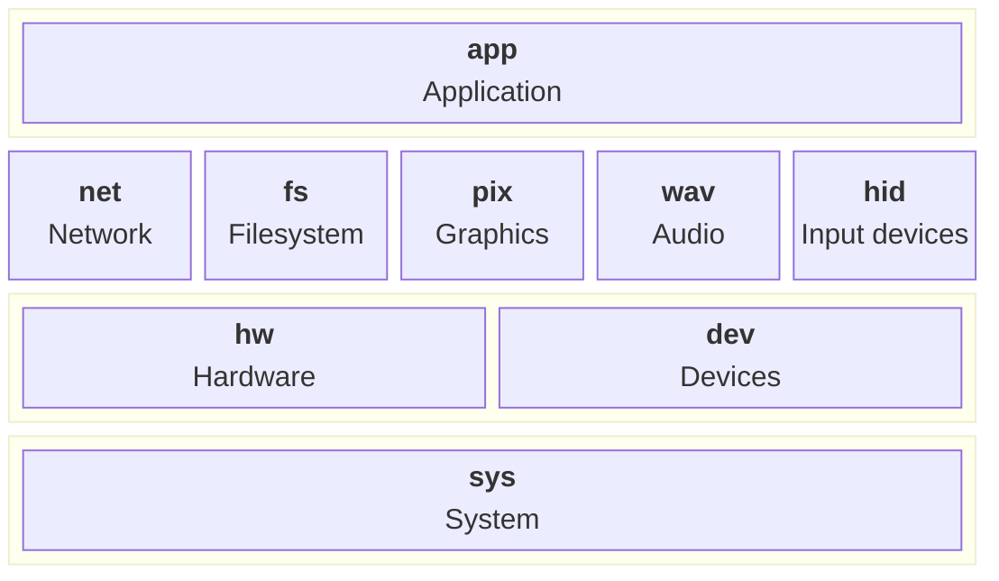

# picofuse

NOTE This is being migrated to <https://github.com/mutablelogic/picofuse>


Picofuse is a software system for hardware-independent development of small event-driven applications. It provides a common interface for hardware peripherals and a build system that abstracts away the details of the underlying hardware. There are a variety of modules which define the abstraction:

* `sys`: System-level functions.
* `hw` : Hardware for peripherals such as GPIO, I2C, SPI, etc.
* `dev` : Device implementation for specific components.
* `net`: Network stack for TCP/IP communication (under development).
* `fs` : Filesystem abstraction for persistent storage (under development).
* `pix`: Graphics library for drawing on displays (planned).
* `wav`: Audio library for playing and recording sound (planned).
* `hid`: Human Interface Device library for handling input devices (planned).
* `app`: Application framework for event-driven programming (under development).



These compile into a static library for each platform or board target, which can be linked into user applications. The build system uses CMake to manage the compilation process and supports multiple platforms, including the Raspberry Pi Pico, Raspberry Pi, Linux and Darwin (Macintosh). The goal is to allow developers to write applications that can run on any supported hardware with minimal changes, by providing a consistent API and handling the platform-specific details within the library.

There are examples in the `examples` directory that demonstrate how to use the library to create simple applications, such as blinking an LED, reading a sensor, or connecting to a network. The documentation for the API is generated with Doxygen and can be found [here](https://djthorpe.github.io/picofuse-sys/).

## Setup

Clone the repository with submodules:

```sh
git clone --recurse-submodules git@github.com:djthorpe/picofuse-sys.git
```

You'll need to satisfy some required (and optional) dependencies for each platform, other than Pico targets which are self-contained, thanks to the Pico SDK.

The following dependencies should be installed, assuming you're using macOS (with [Homebrew](https://brew.sh/)), Debian Linux, or Raspberry Pi OS:

| Dependency | macOS (Homebrew) | Debian/Raspberry Pi OS |
| --- | --- | --- |
| OpenSSL (required) | `brew install openssl@3` | `sudo apt install libssl-dev` |
| WPA Supplicant (optional, for WiFi support) | N/A | `sudo apt install libwpa-client-dev` |
| Mosquitto (optional, for MQTT support) | `brew install mosquitto` | `sudo apt install libmosquitto-dev` |
| USB (optional, for USB support) | `brew install libusb pkgconf` | `sudo apt install libusb-1.0-0-dev` |

## Build and Install

For Pico targets, install the ARM embedded GCC toolchain first. On macOS with
Homebrew:

```sh
brew install --cask gcc-arm-embedded
```

If the toolchain is not on your `PATH`, pass its `bin` directory with
`PICO_TOOLCHAIN_PATH=/path/to/toolchain/bin` in the make command.

Build and install on Linux or Darwin with Make:

```sh
PREFIX=/opt/picofuse make install
```

For Pico targets, include `PICO_BOARD`:

```sh
PREFIX=/opt/picofuse PICO_BOARD=<board> make install
```

Supported `PICO_BOARD` values in this repository include:

| `PICO_BOARD` value | Description | Board Definition |
| --- | --- | --- |
| `pico` | Raspberry Pi Pico (RP2040) | [pico.h](third_party/pico-sdk/src/boards/include/boards/pico.h) |
| `pico_w` | Raspberry Pi Pico W (RP2040 + Wi-Fi) | [pico_w.h](third_party/pico-sdk/src/boards/include/boards/pico_w.h) |
| `pico2` | Raspberry Pi Pico 2 (RP2350) | [pico2.h](third_party/pico-sdk/src/boards/include/boards/pico2.h) |
| `pico2_w` | Raspberry Pi Pico 2 W (RP2350 + wireless) | [pico2_w.h](third_party/pico-sdk/src/boards/include/boards/pico2_w.h) |
| `pimoroni_pico_plus2_rp2350` | Pimoroni Pico Plus 2 (RP2350) | [pimoroni_pico_plus2_rp2350.h](third_party/pico-sdk/src/boards/include/boards/pimoroni_pico_plus2_rp2350.h) |
| `pimoroni_pico_plus2_w_rp2350` | Pimoroni Pico Plus 2 W (RP2350) | [pimoroni_pico_plus2_w_rp2350.h](third_party/pico-sdk/src/boards/include/boards/pimoroni_pico_plus2_w_rp2350.h) |
| `pimoroni_picolipo_16mb` | Pimoroni Pico LiPo with 16MB flash | [pimoroni_picolipo_16mb.h](third_party/pico-sdk/src/boards/include/boards/pimoroni_picolipo_16mb.h) |
| `pimoroni_picolipo_4mb` | Pimoroni Pico LiPo with 4MB flash | [pimoroni_picolipo_4mb.h](third_party/pico-sdk/src/boards/include/boards/pimoroni_picolipo_4mb.h) |
| `pimoroni_tiny2040` | Pimoroni Tiny 2040 | [pimoroni_tiny2040.h](third_party/pico-sdk/src/boards/include/boards/pimoroni_tiny2040.h) |
| `pimoroni_tiny2040_2mb` | Pimoroni Tiny 2040 (2MB flash variant) | [pimoroni_tiny2040_2mb.h](third_party/pico-sdk/src/boards/include/boards/pimoroni_tiny2040_2mb.h) |
| `pimoroni_tiny2350` | Pimoroni Tiny 2350 | [pimoroni_tiny2350.h](third_party/pico-sdk/src/boards/include/boards/pimoroni_tiny2350.h) |
| `pimoroni_pico_lipo2xl_w` | Pimoroni Pico LiPo 2XL W (custom board) | [pimoroni_pico_lipo2xl_w.h](include/boards/pimoroni_pico_lipo2xl_w.h) |
| `presto` | Pimoroni Presto board (custom board) | [presto.h](include/boards/presto.h) |

Other boards can also be used by providing a compatible board definition
header in the include path (for example in `include/boards/`) and selecting
it via `PICO_BOARD=<board_name>`.
